# Animation

When I studied abroad, I took a Functional Programming class where I learned some Haskell. This class was more focused more the idea of functional programming and using the Haskell language to apply these concepts. Coming into this class, I was unsure of what to expect because it's a Programming Languages class where we learn Haskell, among other languages and topics. Although my knowledge of Haskell was minimal even after taking the Functional Programming class, I think it was helpful for taking Programming Languages because they both emphasize the importance of functional programming in various ways. The Functional Programming class seemed to be more practical and applied whereas the Programming Languages class had a more theoretical and conceptual foundation.

In my Functional Programming class, the lecturer provided an [Animation library](Animation/Animation.hs) and showed us cool animations that could be made. For this blog post, I decided to create one because I thought it would be a fun and interesting way to demonstrate my understanding of list comprehensions and the concept of zip while using a predefined module for animations. I chose to create an [Animation](Animation/MyAnimation.hs) of the [Olympics logo](Animation/animation.svg) that starts off as small circles then becomes larger to form the logo.



## Olympics Logo Animation
I will describe my code below. First, I used `combine` for a combination of a list of pictures, then `translate` for a spacial transformation. Next, I spaced each of the circles resembling the five Olympic rings at their respective starting and ending coordinates. In order to change the size of the rings so that it starts small and ends large, I used `cycleSmooth` and did the necessary calculations for the coordinates. I also implemented `scale` for spatial transformation, `withGenBorder` to define the color, opacity, and circle thickness, and `withoutPaint` so it looked like the `ring` of the Olympics logo and the size increased at a smooth pace and continues to repeat. After this, I applied list comprehension and zip to match each circle to the corresponding colors of blue, yellow, black, green, and red for the Olympics logo. Finally, I used `IO()` to save the file as a svg (Scalable Vector Graphics).

```Haskell
picture :: Animation

picture = (combine
            [translate (cycleSmooth 8 [(100*fromIntegral i, 100+50*fromIntegral((i+1) `mod` 2)),
                                       (150+50*fromIntegral i, 200+50*fromIntegral((i+1) `mod` 2))])
                (scale (always (1.1,1.1))
                  (withGenBorder (always color) (always 0.75) (always 5)
                    (withoutPaint (circle (cycleSmooth 8 [0, 40])))))
            |  (i, color) <- zip  [1..5] [blue, yellow, black, green, red]])

test :: IO ()
test = writeFile "animation.svg" (svg 800 600 picture)
```

## How to Run an Animation
If you would like to run my animation or make your own, first download the [Animation library](Animation/Animation.hs). Next, download my [Animation](Animation/MyAnimation.hs) or make your own file with the Haskell extension (`.hs`). Look through the Animation library and read the different functions and their corresponding comments to understand how to use them. My example can serve as a reference for some of the functions, but I only used a few and there are many more available. Make sure that both the Animation library file and your own file (or my example) are in the same folder/directory on your computer.

To run the program and create the `animation.svg` file:
1. Open Terminal
2. Enter `cd` to go to the directory where the files are located
3. Enter `ghci`
4. Enter `:load Animation.hs` to load the Animation library
5. Enter `:load MyAnimation.hs` to load your animation file or my example.
6. After both modules are loaded, enter `test`.

Upon completion of the above steps, the output should look something like this:
```
GHCi, version 8.8.4: https://www.haskell.org/ghc/  :? for help
Prelude> :load Animation.hs
[1 of 1] Compiling Animation        ( Animation.hs, interpreted )
Ok, one module loaded.
*Animation> :load MyAnimation.hs
[1 of 2] Compiling Animation        ( Animation.hs, interpreted )
[2 of 2] Compiling MyAnimation      ( MyAnimation.hs, interpreted )
Ok, two modules loaded.
*MyAnimation> test
```

The animation is called `animation.svg` and should appear in the same folder as the other two files.

#### References
- Ross Patterson (provided the Animation library)
